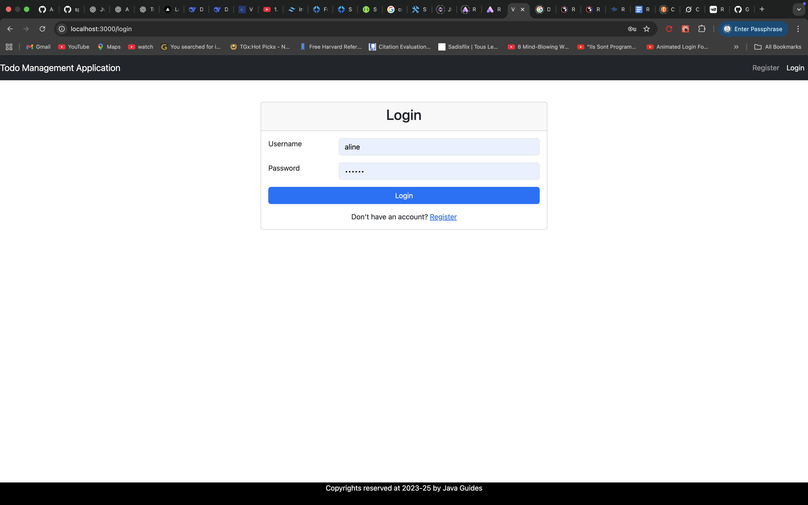

# FullStackTodo_SpringBoot_React

# FullStackTodo – Todo App

**FullStackTodo** is a full-stack todo application built with **React** for the frontend and **Spring Boot** for the backend. Users can manage tasks, track completion status, and filter tasks efficiently.

---

## Features

* **User Authentication**
  Users can register and log in to manage their personal todo list.

* **Todo Management**

  * Add, edit, delete todos.
  * Mark todos as completed.

* **Filter & View Todos**

  * Filter tasks by status: All, Completed, or Pending.
  * View detailed information for each todo.

* **Responsive UI**
  Built with React for a modern, interactive interface.

* **RESTful API Backend**

  * Spring Boot handles CRUD operations.
  * Uses PostgreSQL to store todos and user data.

---

## Tech Stack

* **Frontend**: React, Bootstrap
* **Backend**: Spring Boot, Java
* **Database**: PostgreSQL
* **API**: RESTful endpoints
* **Tools**: Maven, Node.js, npm, Postman

---

## Installation

### Backend (Spring Boot)

1. Navigate to the backend folder:

```bash
cd backend-todo
```

2. Configure PostgreSQL database in `application.properties`:

```properties
spring.datasource.url=jdbc:postgresql://localhost:5432/todomgt_db
spring.datasource.username=postgres
spring.datasource.password=
spring.datasource.driver-class-name=org.postgresql.Driver

spring.jpa.database-platform=org.hibernate.dialect.PostgreSQLDialect
spring.jpa.hibernate.ddl-auto=update
spring.jpa.show-sql=true
spring.jpa.properties.hibernate.format_sql=true
```

3. Build and run the backend:

```bash
mvn clean install
mvn spring-boot:run
```

The backend will run on `http://localhost:8080`.

---

### Frontend (React)

1. Navigate to the frontend folder:

```bash
cd ../frontend-todo
```

2. Install dependencies:

```bash
npm install
```

3. Run the React app:

```bash
npm run dev
```

The frontend will run on `http://localhost:3000`.

---

## API Endpoints (Example)

| Method | Endpoint             | Description         |
| ------ | -------------------- | ------------------- |
| GET    | `/api/todos`         | Get all todos       |
| GET    | `/api/todos/{id}`    | Get todo by ID      |
| POST   | `/api/todos`         | Create a new todo   |
| PUT    | `/api/todos/{id}`    | Update a todo       |
| DELETE | `/api/todos/{id}`    | Delete a todo       |
| POST   | `/api/auth/login`    | Authenticate a user |
| POST   | `/api/auth/register` | Register a new user |

---

## Screenshots





---

## License

This project is licensed under the MIT License.


